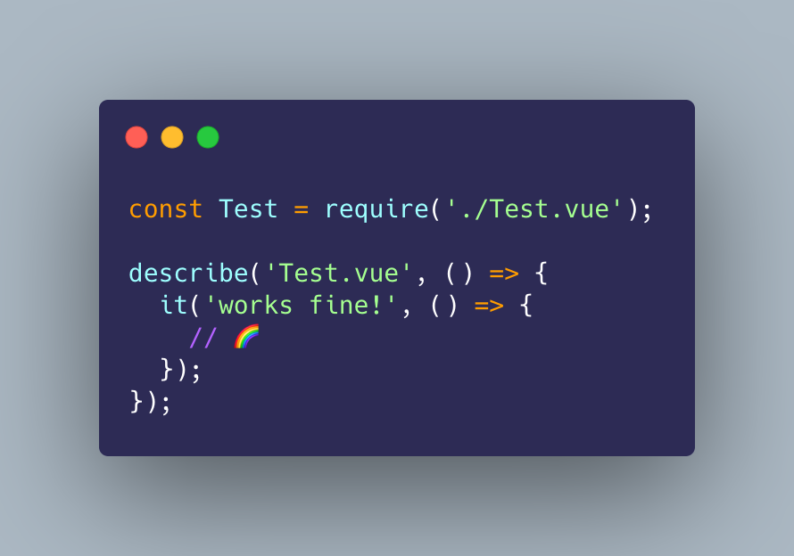

<h2 align="center">vue3-node</h2>

<div align="center">
  
</div>

<br />

<p align="center">[WIP] Vue3 execution environment for node.js</p>

<div align="center">

[](https://badge.fury.io/js/vue3-node)


</div>

## Installation

via NPM

```
$ npm install vue3-node
```

via Yarn

```
$ npm install vue3-node
```

## Usage

Insert vue3-node into preload script

```json
// package.json
{
  "scripts": {
    "test": "node -r vue3-node ./tests/a.spec.ts"
  }
}
```

Programmatically

```ts
require('vue3-node');
```

## Feature Planning

- [ ] Sourcemap
